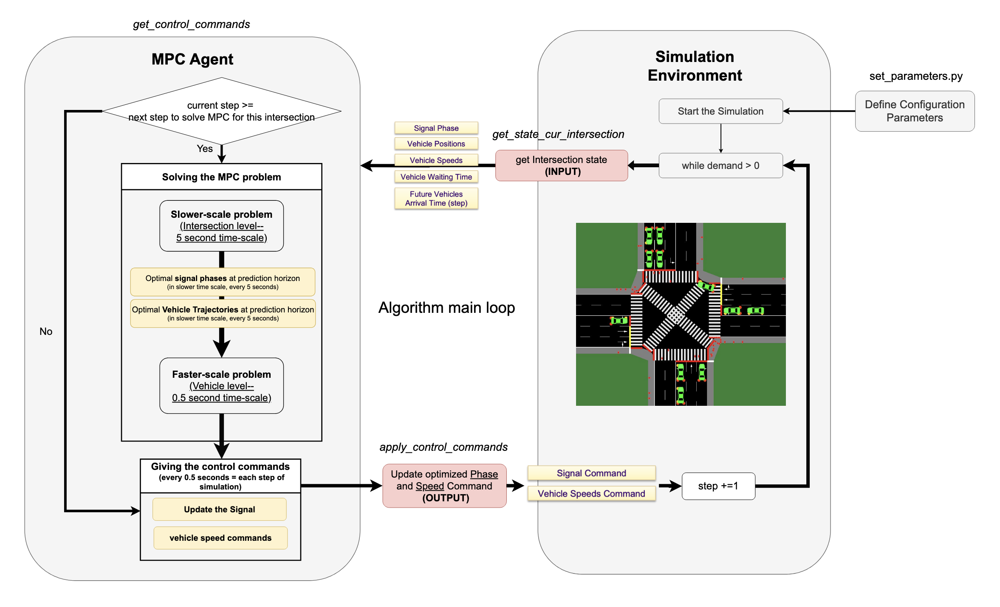

# MMSVCC (Multimodal Multiscale Signal-Vehicle Coupled Control)

## About
This project involves the implementation of an MPC-based Signal-Vehicle Coupled Control (SVCC) model (Developed by Dr. Qiangqiang Guo (guoqq77@gmail.com)) on a single unified 4-leg, 3-lane intersection (inspired by the intersection at Fairview Avenue and Denny Way, Downtown Seattle, WA). The optimization process aims at maximizing throughput, minimizing the total delay and fuel consumption of connected and automated vehicles (CAVs) at signalized intersections.

## Requirements
Python 3.12   
GAMS 46.5 ([Download](https://www.gams.com/download/))  
SUMO 1.20.0  ([Download](https://eclipse.dev/sumo/))  
traci  
sumolib  
numpy  
gamsapi  
matplotlib  

### Installation
Please follow the instruction on [this link](https://www.gams.com/latest/docs/API_PY_GETTING_STARTED.html) for installing the GAMS dependencies and troubleshooting if needed. 

## Structure
- `agent`: Contains the MPC Agent Class which includes the MPC Optimization process.  
    - gams_models: Contains GAMS files solving the Slower-Scale (A2), and Faster-Scale (A3) Optimization problems (refer to the paper [Guo and Ban (2023)](https://www.sciencedirect.com/science/article/abs/pii/S0191261523001121))  
- `config`: Contains functions for setting up the model parameters.
- `environment`: Contains SUMO files and configurations as well as single_intersection class which covers the route builder and network generator of simulation as well as the Input, Output Interfaces (communication with SUMO) for the Unified 4-leg intersection.
- `Results`: Contains Output files generated at the end of simulation provide the following metrics to compare the MMSVCC project performance with other signal timing scenarios (e.g., fixed-time and actuated)
- `Slides`: Contains detailed diagram and documentation on the algorithm.

The whole process is summarized in the diagram below:  



 
Detailed documentiations of the algorithm can be found in /Slides/documentation.docx.  


## Instructions
### 1- Changing the network:
for those interested in changing the study network the following adjustments should be made to the simulation inputs located at /environment/network_model:  
  
1- `single_intersection_pedestrian_X.net.xml`:  
    this includes the infrastructure information (edges, nodes, etc.,) of the network you want to work on. This file can be created using netedit software included in SUMO package. You can also upload the current network file and modify it using netedit. [netedit documentation](https://sumo.dlr.de/docs/Netedit/index.html).   
      
2- `single_intersection.rou.xml`:  
    This file includes the information of the routes and demand of different modes (pedestrians and vehicles). You can find useful information to create or modify this file [here](https://sumo.dlr.de/docs/Definition_of_Vehicles%2C_Vehicle_Types%2C_and_Routes.html). You can also model the demand using [netedit](https://sumo.dlr.de/docs/Netedit/elementsDemand.html).   
      
3- `Additional files` (`single_intersection.add_fixed_time.xml`, `single_intersection.add_actuated.xml`, single_intersection.add.xml(for both Concurrent phasing: `single_intersection_Concurrent.add.xml` and for Exclusive phaseing `single_intersection_Exclusive.add.xml` if desired)):   
    these files take account of signal phasing for the fixed time, actuated and multiscale scenario respectively. These additional files can be extracted from netedit after you define your desired signal phasing plan. You can find the instructions [here](https://sumo.dlr.de/docs/Simulation/Traffic_Lights.html). It should also be convenient to just manually adjust the add.xml files according to your new signal timing plan.  
NOTE1: For the Multiscale additional file, you wanna make sure that the green phases come first, followed by their respective yellow phases (in the same order of their corresponding green), and the all-red phase at the end. set the program ID to "my_program".  
NOTE2: Make sure to allocate enough time for pedestrians crossing the street when defining the minimum duration for actuated signal phasing (e.g., approximate time needed to cross = length of crossing/average pedestrian speed).  


**important: after you finished changing these files accordingly, make sure to update the sumo configuration file inputs in `.sumocfg` files (for all three scenarions) if any input file name is adjusted.  
  
After adjusting the simulation input files, you need to manually adjust the optimization files located in /agent/gams_models:  
4- `unified_four_legs_three_lanes_slower_Pedestrians.gms` for the Cuncurrent phasing, and `unified_four_legs_three_lanes_slower_Pedestrians (Exclusive).gms` for Exclusive phasing:   
Equation 23e should be adjusted based on right of ways of each vehicle lane r(j,k) and each pedestrian crossing q(m,k) based on their corresponding green phase p(l,k).  
For lane indexes: check their order of storing in self.network_graph[inter_id][‘incoming_veh’] which are the incoming vehicle lanes to the intersection in sumo_network_reader.py. then based on their order, their index will start from 1 to the total number of lanes. It should be the same order of their appearance in the SUMO network file you generated as well.  
For phase indexes: The index is again based on the order of appearance of green phases in the additional file for signal phasing.   
For crossing indexes: the dictionary "crossing_number_map" (line 172 of single_intersection.py) should give you that.  
*** note: indexing in GAMS starts from 1  

  
  
Feel free to ask your questions (naderian@uw.edu). I'll be pushing updates to the code (.py files). Make sure to run the new modules after you changed the above files accordingly.  
#### UPDATE: .py files are updated and the new code is available in branch `main-general-networks` for those who want to change the study network:  
to clone the new branch `main-general-networks` go to the terminal in your local directory:  
```terminal
git clone --branch main-general-networks https://github.com/Shakiba97/CET-593-MMSVCC.git
